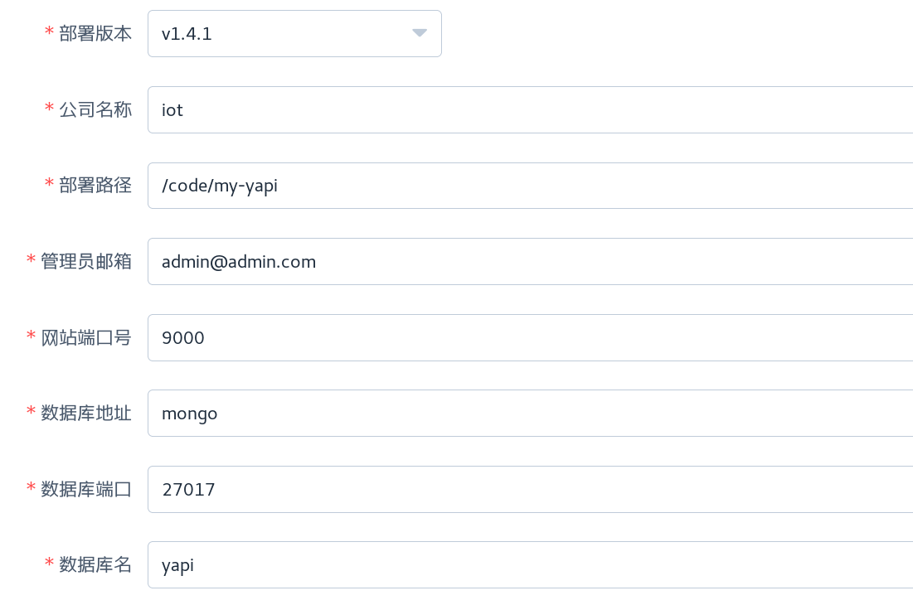

# 说明

## 基于
Yapi: https://yapi.ymfe.org/devops/index.html

## 使用步骤
### 一. 可视化部署
1. `docker-compose up -d`启动服务
2. 访问 http://localhost:9090 打开部署页面
3. 输入部署信息, 如下图；信息输入完整后点击部署，等待部署完成，比较慢耐心等待; 可能会失败，点击部署多尝试几次

4. 确认部署完成后，输入`docker-compose up -d --build`重新启动
5. 访问 http://localhost:9000 打开网站，点击登陆，输入 admin@admin.com/ymfe.org 登陆管理页面，如果登陆成功，则部署OK
